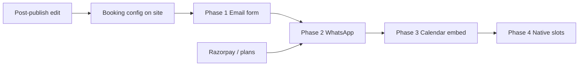

# Booking system — TODO

> **Goal:** Let visitors on a published site request an appointment / table / session, and let the site owner receive it — by **email** (Basic) and **WhatsApp** (Pro), without leaving PaperChai for v1 of booking.

Status: **Phase 1–4 shipped**

### Related docs

- [Post-publish editing](./TODO-post-publish-editing.md) — owners need to configure booking on existing sites
- Pricing promises: **Basic** = email booking · **Pro** = WhatsApp + email booking (`PricingPlans.tsx`)

---

## Problem today

| What works | What's missing |
|------------|----------------|
| CTA copy says “Book appointment”, “Book a table”, etc. | No booking form or flow |
| `mailto:` on CTA when email is set | No structured inquiry to owner |
| `wa.me` link when phone/WhatsApp is set | No pre-filled booking message |
| `storeHours` on business sites | No slot picker or availability |
| SES/Gmail already sends OTP emails | No `sendBookingNotification()` |
| `accounts.plan` (`free` \| `pro`) in DB | No plan gate for booking features |

**Net:** Contact-only sites. “Booking” on the pricing page is marketing — **0% built**.

---

## What we're building (summary)

Four layers, shipped incrementally. Each layer is useful on its own.

| Phase | Name | Visitor experience | Owner experience | Plan gate |
|-------|------|--------------------|------------------|-----------|
| **1** | Email inquiry form | Name, phone, date/time preference, message → submit | Email notification + optional dashboard list | **Basic+** (allow on free during beta — see open questions) |
| **2** | WhatsApp booking | “Book on WhatsApp” opens `wa.me` with pre-filled message | No backend — message lands in owner's WhatsApp | **Pro** |
| **3** | Calendar embed | “Pick a time” → Cal.com / Calendly iframe or link | Owner manages calendar externally | **Pro** (or Basic with link-only) |
| **4** | Native scheduling | Pick slot from owner's availability; confirm by email + WhatsApp | Dashboard: availability, bookings, status | **Pro** (later) |

**MVP for launch:** Phase **1 + 2**. Phase 3 as fast follow. Phase 4 only if embeds aren't enough.

---

## Product alignment (pricing)

| Tier | Promised feature | Maps to |
|------|------------------|---------|
| Free | Contact links only (today) | `mailto` / `tel` / `wa.me` — unchanged |
| Basic | Email booking | Phase 1 — inquiry form + email to owner |
| Pro | WhatsApp + email booking | Phase 1 + Phase 2 (+ Phase 3 embed optional) |

Until Razorpay is live, build features behind `plan` checks but **don't hard-block** — or use a `BOOKING_ENABLED` env flag for staging.

---

## Proposed UX

### Visitor (published site)

```
CTA section / new "booking" block
  → [Book via form]  [WhatsApp]  (Pro)
  → Form: name*, phone*, preferred date, preferred time, service (optional), notes
  → Submit → "Request sent — we'll confirm shortly"
  → (Pro) WhatsApp button: opens wa.me with encoded message
```

Form appears on **business** archetypes first (doctor, restaurant, fitness, consultant). Profile/portfolio sites keep “Get in touch” unless owner enables booking in settings.

### Owner

```
Dashboard → site card → Booking settings
  → Enable booking (on/off)
  → Notification email (default: account email)
  → Services list (optional dropdown on form)
  → WhatsApp number (Pro)
  → Calendly/Cal.com URL (Phase 3)

Dashboard → Bookings tab (Phase 1+)
  → List inquiries: pending / contacted / done
  → Mark status, view details
```

### Edit / configure

Requires **post-publish editing** (or a minimal booking-settings API on dashboard without full site regen):

- Booking config stored on site row or inside `SiteData.booking`
- Toggle + fields editable without regenerating the whole site

---

## Data model

### Phase 1 — `bookings` table

```sql
create table if not exists bookings (
  id           uuid primary key,
  site_id      uuid not null references sites(id) on delete cascade,
  slug         text not null,          -- denormalized for public API
  status       text not null default 'pending',  -- pending | contacted | cancelled | done
  visitor_name text not null,
  visitor_phone text not null,
  visitor_email text,
  preferred_date date,
  preferred_time text,                 -- free text or "morning" / "afternoon"
  service      text,
  notes        text,
  source       text not null default 'form',     -- form | whatsapp
  ip           text,
  created_at   timestamptz not null default now()
);
create index if not exists bookings_site_id_idx on bookings (site_id, created_at desc);
```

### Phase 1 — booking config on site

Extend `SiteData` (or separate `sites.booking` jsonb column):

```ts
interface BookingConfig {
  enabled: boolean;
  /** Email that receives form submissions. Defaults to site owner account email. */
  notifyEmail?: string;
  /** Optional services shown in form dropdown. */
  services?: string[];
  /** Pro: E.164 or local digits for wa.me prefill. */
  whatsappNumber?: string;
  /** Phase 3: external scheduler URL. */
  calendarUrl?: string;
  /** Custom CTA label override, e.g. "Request appointment". */
  buttonLabel?: string;
}
```

Add to `SiteData`:

```ts
booking?: BookingConfig;
```

Add `"booking"` to `SectionType` when `booking.enabled` — renders `BookingSection` in `GeneratedSite`.

---

## API routes

| Route | Method | Purpose | Auth |
|-------|--------|---------|------|
| `/api/booking` | `POST` | Public — submit inquiry for `slug` | Rate limit by IP |
| `/api/sites/[id]/bookings` | `GET` | Owner — list bookings for site | Verified session + owns site |
| `/api/sites/[id]/bookings` | `PATCH` | Owner — update status | Verified session |
| `/api/sites/[id]/booking` | `GET` \| `PATCH` | Owner — read/update `BookingConfig` | Verified session |

Public POST body:

```ts
{
  slug: string;
  name: string;
  phone: string;
  email?: string;
  preferredDate?: string;  // ISO date
  preferredTime?: string;
  service?: string;
  notes?: string;
}
```

---

## Implementation phases

### Phase 1 — Email inquiry form (MVP)

- [x] `BookingConfig` type + optional `booking` on `SiteData`
- [x] `bookings` table in `ensureSchema()`
- [x] `sendBookingNotification(ownerEmail, booking, siteName)` in `src/lib/email.ts`
- [x] `POST /api/booking` — validate slug, check `booking.enabled`, insert row, send email
- [x] Rate limit: `booking` route (per IP + per slug, 10/hour default)
- [x] `BookingSection` component in `GeneratedSite` — form + success state
- [x] Auto-enable booking for new business sites (`applyDefaultBooking`)
- [x] Default `notifyEmail` = site owner's verified account email
- [x] Dashboard: list bookings + settings at `/dashboard/[id]`
- [x] Dashboard PATCH for booking config (`/api/sites/[id]/booking`)
- [x] Honeypot spam field on form
- [x] `.env.example` notes for booking

### Phase 2 — WhatsApp booking (Pro)

- [x] `buildWhatsAppBookingUrl(config, prefilled)` — `wa.me/<digits>?text=<encoded>`
- [x] `BookingSection`: secondary **WhatsApp** button when Pro + number set
- [x] Plan check: `bookingWhatsAppAllowed(plan)` on PATCH and published page

### Phase 3 — Calendar embed

- [x] `BookingConfig.calendarUrl` — Calendly, Cal.com, Google Calendar, Outlook links
- [x] `BookingSection`: **Pick a time** tab with inline iframe (or link-out fallback)
- [x] URL allowlist + validation in `src/lib/calendar-embed.ts` and PATCH API
- [x] No PaperChai calendar storage — owner manages calendar externally
- [x] Dashboard field with helper copy

### Phase 4 — Native scheduling (later)

- [x] `booking.native` on `SiteData` — weekly slots per site (no separate table)
- [x] Slot picker UI — respect `storeHours` fallback + owner weekly hours + blackout dates
- [x] Double-booking prevention — unique index on `(site_id, slot_start)`
- [x] Confirmation email to visitor (requires visitor email)
- [x] Owner dashboard: availability editor, bookings list, export CSV
- [ ] SMS reminder (optional, India DLT complexity — defer)

---

## Generated site integration

### New section: `booking`

Insert in section order for business sites (after `services` or before `cta`):

```ts
// compose.ts / defaultSections
if (site.booking?.enabled && site.archetype === "business") {
  sections.push({ type: "booking", heading: "Book with us", label: "Booking" });
}
```

### CTA behavior when booking enabled

- Primary CTA scrolls to `#booking` instead of `mailto:`
- Keep `mailto` / WhatsApp in contact row as fallbacks

### Domain-aware defaults

| Domain | Default services (dropdown) | Default button label |
|--------|----------------------------|----------------------|
| doctor | Consultation, Follow-up, Check-up | Book appointment |
| restaurant | Table for 2, Table for 4+, Private event | Request a table |
| fitness | Intro session, Personal training | Book a session |
| consultant | Discovery call, Strategy session | Book a call |

---

## Plan gating

```ts
function canUseEmailBooking(plan: Plan): boolean {
  return plan === "pro" || plan === "basic"; // extend Plan type when Basic ships
}

function canUseWhatsAppBooking(plan: Plan): boolean {
  return plan === "pro";
}
```

Until `basic` exists in code, treat `pro` as all booking or use env:

```env
# Allow booking on free plan during development
BOOKING_ALLOW_FREE=true
```

---

## Files to touch (Phase 1–2)

| File | Change |
|------|--------|
| `src/lib/types.ts` | `BookingConfig`, `SectionType` + `"booking"` |
| `src/lib/db.ts` | `bookings` table |
| `src/lib/booking.ts` | **new** — create, list, validate |
| `src/lib/email.ts` | `sendBookingNotification()` |
| `src/lib/whatsapp.ts` | **new** — `buildWhatsAppBookingUrl()` |
| `src/lib/compose.ts` | insert booking section |
| `src/lib/template.ts` / `ai/generate.ts` | default booking config for business sites |
| `src/app/api/booking/route.ts` | **new** — public POST |
| `src/app/api/sites/[id]/bookings/route.ts` | **new** — owner GET/PATCH |
| `src/app/api/sites/[id]/booking/route.ts` | **new** — config GET/PATCH |
| `src/components/generated/BookingSection.tsx` | **new** |
| `src/components/generated/GeneratedSite.tsx` | render `booking` section |
| `src/app/dashboard/page.tsx` | bookings list + settings link |
| `src/app/dashboard/[id]/bookings/page.tsx` | **new** (optional) |
| `.env.example` | `BOOKING_ALLOW_FREE`, rate limit notes |
| `docs/TODO-post-publish-editing.md` | cross-link |

---

## Dependencies & order



**Recommended build order:**

1. Post-publish editing (minimal: PATCH `SiteData.booking` without full regen)
2. Phase 1 email booking
3. Payments / plan enforcement
4. Phase 2 WhatsApp
5. Phase 3 calendar embed
6. Phase 4 only if needed

---

## Edge cases

- [ ] Site has no `notifyEmail` and booking enabled → disable form, show contact links only
- [ ] SES sandbox → owner must verify recipient email (document in dashboard)
- [ ] Spam: honeypot, rate limit, max notes length (2000 chars)
- [ ] Visitor submits invalid phone → validate Indian + international formats loosely
- [ ] `storeHours` closed day selected → warn but don't block (owner confirms manually in v1)
- [ ] Deleted site → cascade delete bookings
- [ ] Booking on free plan after downgrade → hide section, keep data

---

## Manual test plan

1. Enable booking on a restaurant site → form visible on live URL
2. Submit form → owner receives email; row in dashboard
3. Rate limit: 11th submission in 1 hour → 429
4. Pro site with WhatsApp → button opens wa.me with correct prefill
5. Booking disabled → section hidden; CTA falls back to mailto
6. No `EMAIL_FROM` configured → form shows “contact via phone” fallback, log in dev

---

## Open questions

1. **Free tier during beta** — allow email booking on free to drive adoption, gate only WhatsApp?  
   → **Suggest:** email booking on free; WhatsApp on Pro.

2. **Visitor confirmation email** — send “we received your request” to visitor?  
   → **MVP:** owner-only notification; visitor gets on-page success message.

3. **Booking section vs CTA only** — separate section or inline in CTA?  
   → **Suggest:** dedicated `#booking` section for business; cleaner form layout.

4. **Edit mode vs dashboard-only config** — can owner set booking without full site edit?  
   → **Suggest:** dashboard PATCH for `booking` config first (faster).

5. **Cal.com vs Calendly** — support both via generic URL in Phase 3.

6. **Agency tier** — multiple notification emails? Defer.

---

## Success criteria

- [ ] Visitor can submit a booking request from a live business site
- [ ] Owner receives email within 1 minute (when SES configured)
- [ ] Pro owner can offer WhatsApp booking with pre-filled message
- [ ] Bookings visible in dashboard with status
- [ ] Rate-limited and spam-resistant
- [ ] Pricing page claims match shipped behavior

---

*Last updated: 2026-06-10*
